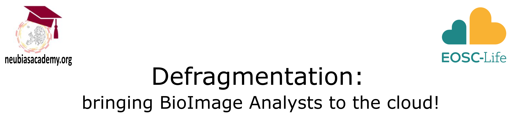

# Defragmentation Training School - NEUBIAS Academy & EOSC-Life 2022

A training school for the new generation of bioimage analysts. Topics: workflow-based image analysis and new integrated methods for cloud computing applied to life sciences.

### "Defragmentation: bringing BioImage Analysts to the cloud!”
#### Registration form:
https://docs.google.com/forms/d/e/1FAIpQLSeyiFfdfRYAcQQB73dGy7WuclvkB_RiKxHncAd_HGwN_geFgA/viewform

#### Registration deadline: 14 August 2022

#### Programme:

|Date | Day | Topics | Sessions|
|-----|-----|--------|---------|
|23 September | Day 1 | <b>Introduction to bioimage analysis, tools, and workflows</b> |
“BioImage: correlated multimodal imaging in life sciences and the problem of big data management for core facilities”  <b>Julia Fernandez-Rodriguez</b>

“Introduction to what is bioimage analysis”  <b>Kota Miura</b>

“BioImage Analysis as a Service at Euro-Bioimaging: an opportunity to get help or use your expertise for the community”  <b>Aastha Mathur</b>
 
“Jupyter for interactive cloud computing”  <b>Guillaume Witz</b>
 
“Jupyter exercises”  <b>Guillaume Witz</b>
|
|30 September | Day 2 | 
<b>FAIR principles</b>
  
<b>Cloud hosted image data and cloud infrastructures</b>
   
<b>Machine and Deep Learning on the cloud I</b>
 
<b>Machine and Deep Learning on the cloud II</b>
|
“Introduction to FAIR principles for computational workflows”  <b>Carole Goble</b>

“Cloud hosted image data storage, visualisation and sharing”  <b>Christian Tischer</b>

“Machine and Deep Learning on the cloud: Classification”  <b>David Rousseau</b>
 
“Machine and Deep Learning on the cloud: Segmentation”  <b>Ignacio Arganda-Carreras</b>
|
|7 October | Day 3 | 
<b>Examples of bioimage analysis workflows</b>
|
“Zero code tools for bioimage analysis”  <b>Daniel Sage</b>

“CellProfiler for HCS data on the cloud”  <b>Beth Cimini and Anna Klemm</b>

“Analysis of Microtubule Orientation”  <b>Thomas Pengo</b>
|
|14 October | Day 4 | 
<b>Parallelization: from CPU to GPU - how to speed up workflows</b>
   
<b>Work on your own data</b>
|
“Parallelization and heterogeneous computing: from pure CPU to GPU-accelerated image processing”  <b>Robert Haase</b>

“Introduction to Galaxy workflow environment”  <b>Beatriz Serrano-Solano and Björn Grüning</b>

Trainees will be split into groups and they will start working on the selected workflows to convert them into a cloud solution
|
|21 October | Day 5 | 
<b>Benchmarking theory</b>
 
<b>Benchmarking tools</b>
 
<b>Work on your own data</b>
|
“Metrics and Benchmarking”  <b>Michal Kozubek</b>

“BIAFLOWS: A BioImage Analysis workflows benchmarking platform”  <b>Sébastien Tosi and Volker Baecker</b>

Trainees will present their cloud workflows
|

 
Scientific Organizers: <b>Rocco D'Antuono, Paula Sampaio, Mafalda Sousa, Clara Prats, Marion Loveaux</b>.
 
Scientific Advisory Board: <b>Julien Colombelli, Paula Sampaio, Julia Fernandez-Rodriguez, Gaby Martins</b>.

Event Timing:
Training school distributed over 5 CEST Friday afternoon classes on
September 23rd and 30th - October 7th, 14th, and 21st.

Event type: Online.

Capacity: max 25 participants.

Participation fee: Euro 100 (to be paid after admission).

Registration form:
https://docs.google.com/forms/d/e/1FAIpQLSeyiFfdfRYAcQQB73dGy7WuclvkB_RiKxHncAd_HGwN_geFgA/viewform

Registration deadline: 14 August 2022

Contacts: rocco.dantuono@crick.ac.uk  
Please use the following subject: Defragmentation TS
